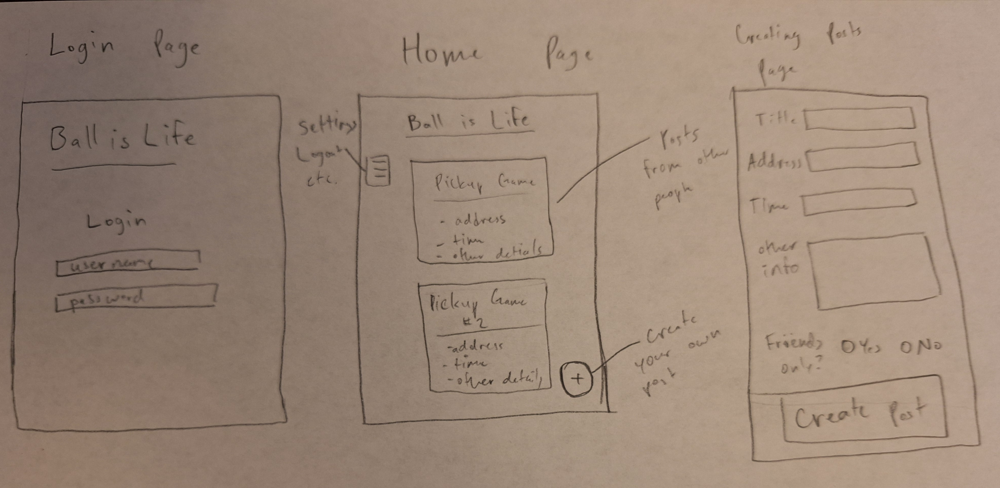

# Pickup
My web application project. Will hopefully be great.

Notes can be found [here](notes.md).

## Specification 

### Elevator Pitch
People who enjoy playing basketball sometimes don't have anyone available to play with when they want to start a game of pickup. "Pickup" is a web application that allows people to connect online and either host or join pickup games posted on the application. This way whenever you are bored and want to play some basketball, you can hop on Pickup and either look for games near you or create your own and invite others to join. You can make games only available for your friends, or for anyone on the app. 

### Design
There will be 3 HTML pages, one for logging in, one for viewing other posts, and one for creating your own posts. This is a rough sketch of what these pages will look like:

### Key Features
- Secure login over HTTPS
- Display of posts of pickup games near you
- Ability to choose viewing options (friends only or everyone)
- Ability to create your own posts with location and time information
- Ability to RSVP to others posts
- Ability to search other profiles and add friends

### Technologies
I am using the required technologies in the following ways:

- **HTML:** Will use correct HTML structure. Will have 3 HTML pages. One for login, one for viewing posts, and one for creating posts.
- **CSS:** Good styling to make it look nice.
- **JavaScript/React:** Will provide login, display others posts, allow you to react/RSVP to others posts.
- **Service:** Backend service that allows for people to create posts for others to see, and react to other posts.
- **Database/Login:** Stores users in a database. Ability to register and login users. Authentication required to create or see posts.
- **WebSocket:** You will be notified of new posts by others, and they will be presented on your screen.

## HTML Deliverable
Here is how I created the structure of my application in HTML:

- **HTML Pages -** 5 HTML pages for login, home, settings, about, and creating posts.
- **Links -** Links to home, login, about, and settings pages from all pages. Link to create posts from home page.
- **Text -** About page contains text about the startup.
- **Images -** Image included on the homepage.
- **Login -** Input box and submit button for login.
- **Databse -** User info stored in database. User database data displayed in Preferences page.
- **WebSocket -** The home page will display current games created by other users, along with game info.

## CSS Deliverable
Here is how I designed the appearance my application using CSS:

- **Header, Footer, and Main Content -** Added background colors, changed fonts and font sizes, changed spacing, etc.
- **Navigation Elements -** Fixed the navigation bar on top of the screen so that it follows the page when scrolling, formatted text as to not look like links
- **Responsive -** Used flex to make the webpage responsive to different size screens
- **Application Elements -** Formatted all elements to have good spacing and contrast, everything is easy to see and read
- **Text Content -** Font is consitent
- **Image Content -** Images are formatted to have rounded edges or be circular in shape

## React Deliverable
I converted my startup to Javascript and React:

- **Bundled and transpiled**
- **Router -** Routing between different pages and from Home to creating a post